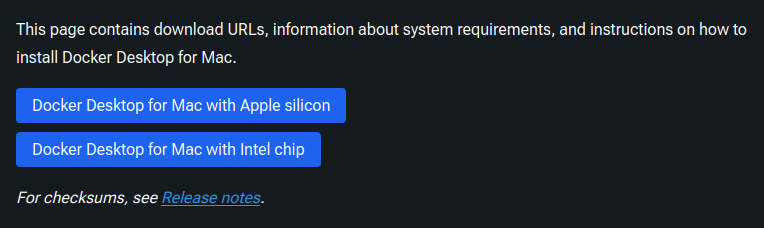

### Bash shell

You already have it! Depending on which version of Mac OS you’re running you may
need to type `bash` inside the terminal to access it. To check whether this is
necessary, follow these steps:

1. Open a terminal and type `echo $SHELL`. If it reads `/bin/bash` then you are
   all set!

Note: If you are using Mac Catalina (10.15.X) or later, then it is possible your default
shell is NOT CORRECT. To set the default to bash, type `chsh -s /bin/bash` in
the terminal, enter your password when prompted, and then close + re-open the
terminal.

### Homebrew

Install the [Homebrew](https://brew.sh/) package manager: open a terminal window, type this command, then press `Enter`:

```bash
/bin/bash -c "$(curl -fsSL https://raw.githubusercontent.com/Homebrew/install/HEAD/install.sh)"
```

### Git

You may already have it!
Try opening a terminal and typing `git --version`.

If this prints something like `git version X.XX.X`, git is already installed! If so, skip to the next section on "Git configuration".

If `git` is not installed, then you might get a pop-up window prompting you to install the Xcode Command Line Tools, which we will **not** do: click "Cancel". We will install `git` with Homebrew instead.

In the terminal, run:

```bash
brew install git
```

(If you already installed `git` through the Xcode Command Line Tools, that is fine, so you don't need to worry.)

Verify the installation by running `git --version`: this time you should see something like `git version X.XX.X`.



#### Creating an SSH key for GitHub

When following the GitHub docs below, make sure to select the **Mac** instructions.



### VSCode

1. Go to [this page](https://code.visualstudio.com/) and click the download button.
1. Unzip the downloaded file (for example, `VSCode-darwin-universal.zip`) and move the resulting `Visual Studio Code` file to your Applications directory.

#### VSCode extensions

1. Open the Visual Studio Code application
1. Type `Cmd+Shift+P` to open the "command palette" at the top of the screen and then enter
   `Shell command: Install 'code' command in PATH`.
   Select the highlighted entry.
   A notification box should appear in the bottom-right corner indicating that the command was installed successfully.
1. Open the Extension side panel by pressing `Cmd+Shift+X`.
   In the search bar at the top of this panel
   search for each of the following extensions and press `Install` for the first entry that appears.



### Python

1. Open a new terminal and type the following command, then press `Enter`.
   - If you are on an Apple Silicon Mac (upper left corner Apple menu  -> `About This Mac` says something like "Chip: Apple M1" (or M2, etc.)):
      ```bash
      curl -O https://repo.anaconda.com/miniconda/Miniconda3-latest-MacOSX-arm64.sh
      ```
   - Otherwise:
      ```bash
      curl -O https://repo.anaconda.com/miniconda/Miniconda3-latest-MacOSX-x86_64.sh
      ```

1. Run the installation script:
   ```bash
   bash Miniconda3-latest-MacOSX-x86_64.sh
   ```
   - A license agreement will be displayed and the bottom of the terminal will read `--More--`.
   Press `Enter` or the space bar until you are prompted with "Do you accept the license terms? [yes|no]."
   Type `yes` and then press `Enter`
   - The installation script will inform you that it is going to install into a default directory (e.g., `/Users/$USER/miniconda3`).
   Leave this default and press `Enter`.
   - When you are asked "Do you wish the installer to initialize Miniconda3 by running conda init? [yes|no]," type `yes` and press `Enter`.
   - Exit the terminal once the installation has finished.
1. Re-open a terminal.
   Type `which python` into the terminal and it should return a path (e.g., `/Users/$USER/miniconda3/bin/python`).
   - If you do not see a path like this then please try typing `conda init`, closing your terminal, and repeating this step.
     If your issue is still not resolved. skip the following step and contact an instructor on the #help-installation channel of the QLS612-BHS Slack.
1. Type the following to remove the installation script that was downloaded:

   ```bash
   rm ./Miniconda3-latest-MacOSX-x86_64.sh
   ```

#### Python packages



### Docker

1. Go to
   [this page](https://docs.docker.com/desktop/setup/install/mac-install/)
   and press the button `Docker Desktop for...` corresponding to the chip of your machine (see the image below).

   [](https://docs.docker.com/desktop/setup/install/mac-install/)

1. Open the `Docker.dmg` file that is downloaded and drag and drop the icon to the Applications folder.

1. Open the Docker application and enter your password.
   An icon will appear in the status bar in the top-left of the screen.
   Wait until it reads `Docker Desktop is now up and running!`

1. Open a new terminal and type `docker run hello-world`.
   A brief introductory message should be printed to the screen.

The above step-by-step Docker instructions are distilled from
[here](https://docs.docker.com/desktop/setup/install/mac-install/).
If you have questions during the installation procedure please check that link for potential answers!

---

<a href="{{ site.url }}/setup/setup.html"><button>BACK</button></a>
